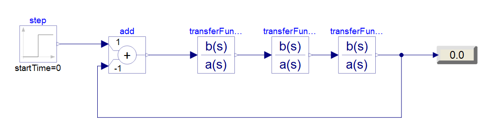
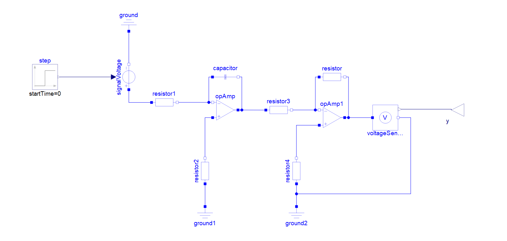
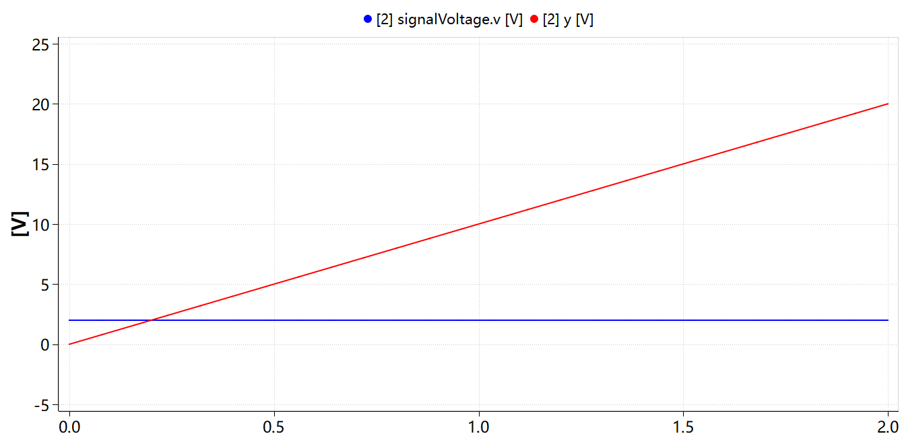

## 任务一代码和运行结果：

### 代码：

```MATLAB

    %% ========== 第(1)题 ==========
    % 特征方程: s^5 + 6s^4 + 13s^3 + 18s^2 + 22s + 12 = 0
    disp('');
    disp('========== 第(1)题 ==========');
    disp('特征方程: s^5 + 6s^4 + 13s^3 + 18s^2 + 22s + 12 = 0');

    % ---- 方法1：劳斯表 ----
    disp('--- 劳斯表 ---');
    % 构造劳斯表初始矩阵 (6行3列)
    % 第1行(s^5): [1, 13, 22]  (s^5, s^3, s^1 的系数)
    % 第2行(s^4): [6, 18, 12]  (s^4, s^2, s^0 的系数)
    a = [1 13 22; 6 18 12; 0 0 0; 0 0 0; 0 0 0; 0 0 0];
    for n = 3:6
        for j = 1:2
            a(n,j) = (a(n-1,1)*a(n-2,j+1) - a(n-2,1)*a(n-1,j+1)) / a(n-1,1);
        end
        % 检查第一列是否为零行(全零行)
        if a(n,1) == 0 && a(n,2) == 0
            % 全零行：用上一行构造辅助多项式，求导后代入
            disp(['  第', num2str(n), '行出现全零行，用辅助多项式求导处理']);
            % 辅助多项式为第(n-1)行对应的偶次多项式
            % 第(n-1)行: [a(n-1,1), a(n-1,2), a(n-1,3)]
            % 对应多项式: a(n-1,1)*s^k + a(n-1,2)*s^(k-2) + a(n-1,3)*s^(k-4)
            % 求导后: k*a(n-1,1)*s^(k-1) + (k-2)*a(n-1,2)*s^(k-3) + ...
            % 代入系数: 用导数系数替换全零行
            k = 6 - (n-1);  % 辅助多项式最高次幂
            % 简化处理: 对低次情况直接赋值
            % 第(n-1)行为 [a1, a2, a3], 对应 a1*s^k + a2*s^(k-2) + a3*s^(k-4)
            % 求导: k*a1*s^(k-1) + (k-2)*a2*s^(k-3) + (k-4)*a3*s^(k-5)
            a(n,1) = k * a(n-1,1);
            a(n,2) = (k-2) * a(n-1,2);
            if a(n-1,3) ~= 0
                a(n,3) = (k-4) * a(n-1,3);
            end
        end
        % 检查第一列是否为0但非全零行
        if a(n,1) == 0 && a(n,2) ~= 0
            a(n,1) = 1e-10; % 用极小正数epsilon代替0
        end
    end
    disp('劳斯表:');
    disp(a);

    % 判断稳定性：检查第一列符号变化
    col1 = a(:,1);
    sign_changes = 0;
    for i = 2:length(col1)
        if col1(i-1) * col1(i) < 0
            sign_changes = sign_changes + 1;
        end
    end
    if sign_changes == 0
        disp(['劳斯表第一列无符号变化，但存在全零行(有纯虚根)，系统为临界稳定']);
    else
        disp(['劳斯表第一列符号变化', num2str(sign_changes), '次，系统不稳定']);
    end

    % ---- 方法2：求根法 ----
    disp('--- 求根法 ---');
    delta1 = [1, 6, 13, 18, 22, 12];  % 多项式系数，降幂排列
    r1 = roots(delta1);
    disp('特征根:');
    disp(r1);
    if all(real(r1) < -1e6)
        disp('所有根实部为负，系统渐近稳定');
    elseif any(real(r1) > 1e6)
        disp('存在实部为正的根，系统不稳定');
    else
        disp('存在实部为零的根(纯虚根)，其余根实部为负，系统临界稳定');
    end

    %% ========== 第(2)题 ==========
    % 特征方程: s^5 + s^4 + 4s^3 + 4s^2 + 2s + 1 = 0
    disp('');
    disp('========== 第(2)题 ==========');
    disp('特征方程: s^5 + s^4 + 4s^3 + 4s^2 + 2s + 1 = 0');

    % ---- 方法1：劳斯表 ----
    disp('--- 劳斯表 ---');
    % 第1行(s^5): [1, 4, 2]
    % 第2行(s^4): [1, 4, 1]
    b = [1 4 2; 1 4 1; 0 0 0; 0 0 0; 0 0 0; 0 0 0];
    for n = 3:6
        for j = 1:2
            b(n,j) = (b(n-1,1)*b(n-2,j+1) - b(n-2,1)*b(n-1,j+1)) / b(n-1,1);
        end
        % 检查全零行
        if b(n,1) == 0 && b(n,2) == 0
            disp(['  第', num2str(n), '行出现全零行，用辅助多项式求导处理']);
            k = 6 - (n-1);
            b(n,1) = k * b(n-1,1);
            b(n,2) = (k-2) * b(n-1,2);
            if b(n-1,3) ~= 0
                b(n,3) = (k-4) * b(n-1,3);
            end
        end
        % 检查第一列是否为0但非全零行
        if b(n,1) == 0 && b(n,2) ~= 0
            disp(['  第', num2str(n), '行第一列为0，用epsilon(1e-10)代替']);
            b(n,1) = 1e-10;
        end
    end
    disp('劳斯表:');
    disp(b);

    % 判断稳定性
    col1_b = b(:,1);
    sign_changes_b = 0;
    for i = 2:length(col1_b)
        if col1_b(i-1) * col1_b(i) < 0
            sign_changes_b = sign_changes_b + 1;
        end
    end
    if sign_changes_b == 0
        disp(['劳斯表第一列无符号变化，系统稳定']);
    else
        disp(['劳斯表第一列符号变化', num2str(sign_changes_b), '次，系统不稳定']);
    end

    % ---- 方法2：求根法 ----
    disp('--- 求根法 ---');
    delta2 = [1, 1, 4, 4, 2, 1];
    r2 = roots(delta2);
    disp('特征根:');
    disp(r2);
    if all(real(r2) < 0)
        disp('所有根实部为负，系统渐近稳定');
    elseif any(real(r2) > 0)
        disp('存在实部为正的根，系统不稳定');
    else
        disp('存在实部为零的根(纯虚根)，其余根实部为负，系统临界稳定');
    end

    %% ========== 第(3)题 (自选) ==========
    % 特征方程: s^4 + s^3 + s^2 + s + 1 = 0
    disp('');
    disp('========== 第(3)题 (自选) ==========');
    disp('特征方程: s^4 + s^3 + s^2 + s + 1 = 0');

    % ---- 方法1：劳斯表 ----
    disp('--- 劳斯表 ---');
    % 第1行(s^4): [1, 1, 1]  (s^4, s^2, s^0 的系数)
    % 第2行(s^3): [1, 1, 0]  (s^3, s^1, 无 的系数)
    c = [1 1 1; 1 1 0; 0 0 0; 0 0 0; 0 0 0];
    for n = 3:5
        for j = 1:2
            c(n,j) = (c(n-1,1)*c(n-2,j+1) - c(n-2,1)*c(n-1,j+1)) / c(n-1,1);
        end
        % 检查全零行
        if c(n,1) == 0 && c(n,2) == 0
            disp(['  第', num2str(n), '行出现全零行，用辅助多项式求导处理']);
            k = 5 - (n-1);
            c(n,1) = k * c(n-1,1);
            c(n,2) = (k-2) * c(n-1,2);
            if c(n-1,3) ~= 0
                c(n,3) = (k-4) * c(n-1,3);
            end
        end
        % 检查第一列是否为0但非全零行
        if c(n,1) == 0 && c(n,2) ~= 0
            disp(['  第', num2str(n), '行第一列为0，用epsilon(1e-10)代替']);
            c(n,1) = 1e-10;
        end
    end
    disp('劳斯表:');
    disp(c(1:5,1:3));

    % 判断稳定性
    col1_c = c(1:5,1);
    sign_changes_c = 0;
    for i = 2:length(col1_c)
        if col1_c(i-1) * col1_c(i) < 0
            sign_changes_c = sign_changes_c + 1;
        end
    end
    if sign_changes_c == 0
        disp(['劳斯表第一列无符号变化，系统稳定']);
    else
        disp(['劳斯表第一列符号变化', num2str(sign_changes_c), '次，系统不稳定']);
    end

    % ---- 方法2：求根法 ----
    disp('--- 求根法 ---');
    delta3 = [1, 1, 1, 1, 1];
    r3 = roots(delta3);
    disp('特征根:');
    disp(r3);
    if all(real(r3) < 0)
        disp('所有根实部为负，系统渐近稳定');
    elseif any(real(r3) > 0)
        disp('存在实部为正的根，系统不稳定');
    else
        disp('存在实部为零的根(纯虚根)，其余根实部为负，系统临界稳定');
    end
```

### 运行结果：
```
    ========== 第(1)题 ==========
    特征方程: s^5 + 6s^4 + 13s^3 + 18s^2 + 22s + 12 = 0
    --- 劳斯表 ---
    第5行出现全零行，用辅助多项式求导处理
    劳斯表:
        1    13    22
        6    18    12
        10    20     0
        6    12     0
        12     0     0
        12     0     0
        
    劳斯表第一列无符号变化，但存在全零行(有纯虚根)，系统为临界稳定
    --- 求根法 ---
    特征根:
                -3.0000 + 0i
        -1.3323e-15 + 1.4142i
        -1.3323e-15 - 1.4142i
                -2.0000 + 0i
                -1.0000 + 0i
        
    存在实部为零的根(纯虚根)，其余根实部为负，系统临界稳定

    ========== 第(2)题 ==========
    特征方程: s^5 + s^4 + 4s^3 + 4s^2 + 2s + 1 = 0
    --- 劳斯表 ---
    第3行第一列为0，用epsilon(1e-10)代替
    劳斯表:
                1    4    2
                1    4    1
        1.0000e-10    1    0
        -1.0000e10    1    0
                1    0    0
                1    0    0
        
    劳斯表第一列符号变化2次，系统不稳定
    --- 求根法 ---
    特征根:
        0.0365 + 1.8708i
        0.0365 - 1.8708i
            -0.7981 + 0i
        -0.1374 + 0.5822i
        -0.1374 - 0.5822i
        
    存在实部为正的根，系统不稳定

    ========== 第(3)题 (自选) ==========
    特征方程: s^4 + s^3 + s^2 + s + 1 = 0
    --- 劳斯表 ---
    第3行第一列为0，用epsilon(1e-10)代替
    劳斯表:
                1    1    1
                1    1    0
        1.0000e-10    1    0
        -1.0000e10    0    0
                1    0    0
        
    劳斯表第一列符号变化2次，系统不稳定
    --- 求根法 ---
    特征根:
        0.3090 + 0.9511i
        0.3090 - 0.9511i
        -0.8090 + 0.5878i
        -0.8090 - 0.5878i
        
    存在实部为正的根，系统不稳定
```

## 任务二代码和运行结果

### 代码：

```MATLAB
    clc;
    clear;

    %% (1) G(s)=50/[s(s+1)(s+2)]
    num1=[50];
    den1=conv(conv([1 0],[1 1]),[1 2]);  %开环分母
    den_cl1=den1+[0 0 0 num1];            %闭环特征方程: D(s)+N(s)
    [z1 p1 k1]=tf2zp(num1,den_cl1);      %求闭环零极点
    sys1=tf(num1,den_cl1);
    pzmap(sys1);                         %绘制零极点图
    title('G(s)=50/[s(s+1)(s+2)]的零极点图');
    p1
    if all(real(p1)<0), disp('系统稳定'), else disp('系统不稳定'), end

    %% (2) G(s)=0.2(s+2)/[s(s+0.5)(s+0.8)(s+3)]
    num2=0.2*[1 2];
    den2=conv(conv(conv([1 0],[1 0.5]),[1 0.8]),[1 3]);  %开环分母
    den_cl2=den2+[zeros(1,length(den2)-length(num2)),num2]; %闭环特征方程
    [z2 p2 k2]=tf2zp(num2,den_cl2);      %求闭环零极点
    sys2=tf(num2,den_cl2);
    figure;pzmap(sys2);                  %绘制零极点图
    title('G(s)=0.2(s+2)/[s(s+0.5)(s+0.8)(s+3)]的零极点图');
    p2
    z2
    if all(real(p2)<0), disp('系统稳定'), else disp('系统不稳定'), end
    if all(real(z2)<0), disp('最小相位系统'), else disp('非最小相位系统'), end

```

### 运行结果：

<figure style="text-align: center; break-inside: avoid; page-break-inside: avoid;">
  
  <figcaption>图 1　第(1)题 G(s)=50/[s(s+1)(s+2)] 闭环零极点图</figcaption>
</figure>

<figure style="text-align: center; break-inside: avoid; page-break-inside: avoid;">
  
  <figcaption>图 2　第(2)题 G(s)=0.2(s+2)/[s(s+0.5)(s+0.8)(s+3)] 闭环零极点图</figcaption>
</figure>

## 任务三代码和运行结果

### 代码：

```MATLAB
    %% ========== 第(1)题 ==========
    % G(s) = Kg(s+2) / [(s+0.3)(s+1.5)(s^2+2s+3)]
    disp('');
    disp('========== 第(1)题 ==========');
    disp('开环传递函数: G(s) = Kg(s+2) / [(s+0.3)(s+1.5)(s^2+2s+3)]');

    % 分子: s+2
    num1 = [1 2];

    % 分母: (s+0.3)(s+1.5)(s^2+2s+3)
    den1 = conv(conv([1 0.3], [1 1.5]), [1 2 3]);
    disp(['开环分母: ', mat2str(den1)]);

    % 构造开环系统
    sys1 = tf(num1, den1);

    % 绘制根轨迹图
    figure(1);
    rlocus(sys1);
    title('第(1)题 根轨迹图: G(s)=Kg(s+2)/[(s+0.3)(s+1.5)(s^2+2s+3)]');
    grid on;

    % 显示开环零极点信息
    [z1, p1, k1] = tf2zp(num1, den1);
    disp('开环零点:');
    disp(z1);
    disp('开环极点:');
    disp(p1);
    disp(['开环增益: ', num2str(k1)]);

    %% ========== 第(2)题 ==========
    % G(s) = Kg / [s(s+2.73)(s^2+2s+2)]
    disp('');
    disp('========== 第(2)题 ==========');
    disp('开环传递函数: G(s) = Kg / [s(s+2.73)(s^2+2s+2)]');

    % 分子: 1
    num2 = 1;

    % 分母: s(s+2.73)(s^2+2s+2)
    den2 = conv(conv([1 0], [1 2.73]), [1 2 2]);
    disp(['开环分母: ', mat2str(den2)]);

    % 构造开环系统
    sys2 = tf(num2, den2);

    % 绘制根轨迹图
    figure(2);
    rlocus(sys2);
    title('第(2)题 根轨迹图: G(s)=Kg/[s(s+2.73)(s^2+2s+2)]');
    grid on;

    % 显示开环零极点信息
    [z2, p2, k2] = tf2zp(num2, den2);
    disp('开环零点:');
    disp(z2);
    disp('开环极点:');
    disp(p2);
    disp(['开环增益: ', num2str(k2)]);

    %% ========== 第(3)题 (自选) ==========
    % G(s) = Kg(s+1) / [s(s+2)(s+3)]
    disp('');
    disp('========== 第(3)题 (自选) ==========');
    disp('开环传递函数: G(s) = Kg(s+1) / [s(s+2)(s+3)]');

    % 分子: s+1
    num3 = [1 1];

    % 分母: s(s+2)(s+3)
    den3 = conv(conv([1 0], [1 2]), [1 3]);
    disp(['开环分母: ', mat2str(den3)]);

    % 构造开环系统
    sys3 = tf(num3, den3);

    % 绘制根轨迹图
    figure(3);
    rlocus(sys3);
    title('第(3)题 根轨迹图: G(s)=Kg(s+1)/[s(s+2)(s+3)]');
    grid on;

    % 显示开环零极点信息
    [z3, p3, k3] = tf2zp(num3, den3);
    disp('开环零点:');
    disp(z3);
    disp('开环极点:');
    disp(p3);
    disp(['开环增益: ', num2str(k3)]);

```

### 运行结果：

<figure style="text-align: center; break-inside: avoid; page-break-inside: avoid;">
  
  <figcaption>图 3　第(1)题 根轨迹图 G(s)=Kg(s+2)/[(s+0.3)(s+1.5)(s²+2s+3)]</figcaption>
</figure>

<figure style="text-align: center; break-inside: avoid; page-break-inside: avoid;">
  
  <figcaption>图 4　第(2)题 根轨迹图 G(s)=Kg/[s(s+2.73)(s²+2s+2)]</figcaption>
</figure>

<figure style="text-align: center; break-inside: avoid; page-break-inside: avoid;">
  
  <figcaption>图 5　第(3)题 根轨迹图 G(s)=Kg(s+1)/[s(s+2)(s+3)]</figcaption>
</figure>

## 任务四模型和运行结果

### 仿真模型：

<figure style="text-align: center; break-inside: avoid; page-break-inside: avoid;">
  
  <figcaption>图 6　仿真1 系统仿真模型</figcaption>
</figure>

### 仿真结果：

<figure style="text-align: center; break-inside: avoid; page-break-inside: avoid;">
  
  <figcaption>图 7　仿真1 输出响应曲线（发散振荡）</figcaption>
</figure>

<figure style="text-align: center; break-inside: avoid; page-break-inside: avoid;">
  
  <figcaption>图 8　仿真1 输出响应曲线（等幅振荡）</figcaption>
</figure>

<figure style="text-align: center; break-inside: avoid; page-break-inside: avoid;">
  
  <figcaption>图 9　仿真1 输出响应曲线（衰减振荡）</figcaption>
</figure>

## 积分环节电路仿真模型和结果

### 仿真模型：

<figure style="text-align: center; break-inside: avoid; page-break-inside: avoid;">
  
  <figcaption>图 10　积分环节电路仿真模型</figcaption>
</figure>

### 仿真结果：

<figure style="text-align: center; break-inside: avoid; page-break-inside: avoid;">
  
  <figcaption>图 11　积分环节电路仿真结果</figcaption>
</figure>